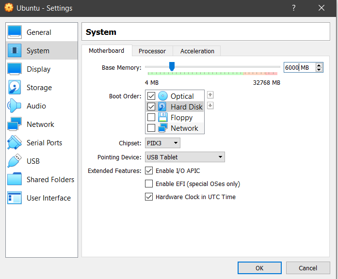
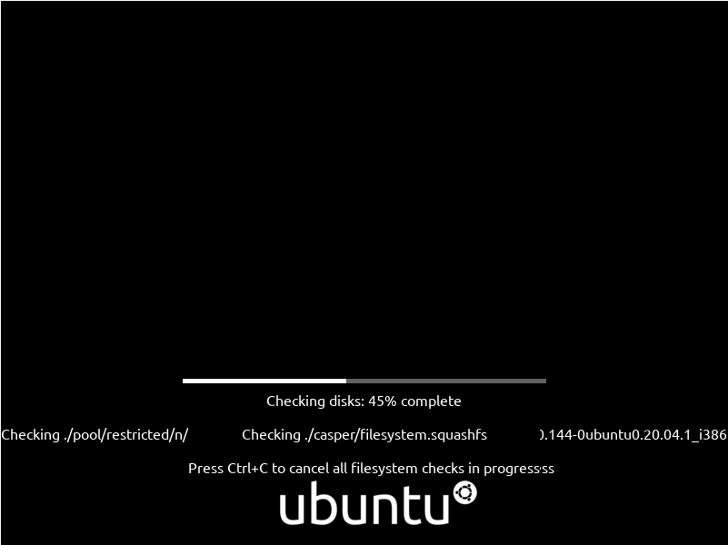

# Deliverable 3
### Name: Junior Nunez
### Date: 12/11/21
#### Due date: End-Of-Semester

 ## &nbsp;&nbsp;&nbsp;&nbsp;&nbsp;&nbsp;&nbsp;&nbsp;&nbsp;&nbsp;&nbsp;&nbsp;&nbsp;&nbsp;&nbsp;&nbsp;&nbsp;&nbsp;&nbsp;&nbsp;[𝍖𝍖𝍖 Default Project  𝍖𝍖𝍖]
# Topic: Setting up a Linux computer for everyday use.

###  Install Ubuntu 20.04
#### Want to know how to install and set up a computer to run Ubuntu Version 20.04? With Linux you will experience true freedom. But before you get a glimpse of that freedom you will need to meet some requirements. 

#### Requirements: 
1.	4GB RAM - At least 4GB otherwise you will suffer.
2.	Dual Core Processor (2 GHZ) 
3.	40GB free disk space (Minimum disk space 25GB) 
4.	Reliable internet Connection - To download the program/iso
5.	Installation media (ISO) [Operating system image]  https://ubuntu.com/download/desktophttps://ubuntu.com/download/desktop
6.	Download Virtual Box - Pick the package according to your platform wether is Mac OS, Linux or a Windows host. -  h

#### Name your machine and select the Linux (Ubuntu) version 64 Bits

 

#### Set the ram for whatever amount higher than 4GB but make sure your machine has a good amount of ram for virtualization and cpu cores for processes/applications running the in the background. 

 

#### Create a virtual hard disk since there is no virtual hard disk available

 

#### Select VirtualBox Disk Image

 

#### Select Dynamically allocated for better storage rendering in your local storage. 

 

#### Set the storage amount to your liking. In this tutorial the amount is 40GB

 

#### Once finished, head over to the settings tab and make the shared clipboard/Drag'n'Drop feature Bidirectional. This will open the door for sharing files between the main operating system and the one running in the virtual machine. Great tool for multitasking! 

 

#### For great video response time max out the video memory to 128MB. Also this is the opportunity to select the monitor count if you wish to virtualize the machine in dual monitors or up to 8. I have the option for 2 monitors but I will leave it at 1.
 

#### Uncheck the floppy disk and bring the optical and hard drisk up in the list using the up arrow icon right next to the boot order window. 
 

#### Select the amount of cores you wish your machine to run with. For dual core cpu I recommend using 1 and the other 1 core will be runned in the background for main system purposes. In my case I will use 4 out of 8. The more cores the better performance. 

#### At this point you will select the iso you downloaded from the original source. 

#### Below we see the screen of the installation

 

#### Select Install Ubuntu

 

#### Select your language

 

#### Select Normal Installation along with third party software

 

#### Proceed to erase the disk

 

#### Continue

 

#### Select Time Zone

 

#### In this point you the user will input the fields asked

 

#### The installation is proceeding and will be done in a matter of minutes

#### Installation complete now proceed to restart. 

#### After your machine has been restarted you will be prompted with the login screen

 

#### You can skip or connect using your credentials to the service of your choice

 

#### This is the homescreen. Installation successful

 

#### Proceed with installing the updates

# IMPORTANT! 
### For the user to get the best out of the system they will need to use certain commands. These commands open the door to many possibilites and time saving tools. Before displaying the commands I will like to show how to update your system and keep it updated. 

 ##                 [𝍖𝍖𝍖 𝚄𝚙𝚍𝚊𝚝𝚒𝚗𝚐 𝚝𝚘𝚘𝚕𝚜 𝍖𝍖𝍖]      
### How to Update Ubuntu and best practices?
Since ubuntu 14.04 we have a new command called "apt". The following command will list out all the packages that you can update, what their current versions are, and what the new version is at the time your machine performed the search. 

'sudo apt list --upgradable'

You are then asked in the CLI wether or not you will like to install the updates. To approve type Y otherwise press N and press Enter key after inserting the choice desired. 

## Basic commands 

Below are some of the commands learned in class (Do not include the quotation marks- they are written so that the reader can see the commands clearly)
 
 'mkdir' - to create directories
 'pwd' - prints the name of the working directory or current folder you are in using the command line
 'cd' - command used to change or move between directories
 'rmdir' - to remove directory or directories
 'rm' - used to delete 
 'ls' - to list files
 'tree' - to list directories in tree hierarchy

# Specific commands
________________________________________________________________________________

# FILE AND DIRECTORY COMMANDS

#### List all files in a long listing (detailed) format
ls -al

#### Display the present working directory
pwd

#### Create a directory
mkdir directory

#### Remove (delete) file
rm file

#### Remove the directory and its contents recursively
rm -r directory

#### Force removal of file without prompting for confirmation
rm -f file

#### Forcefully remove directory recursively
rm -rf directory

#### Copy file1 to file2
cp file1 file2

#### Copy source_directory recursively to destination. If destination exists, copy source_directory into destination, otherwise create destination with the contents of source_directory.
cp -r source_directory destination

#### Rename or move file1 to file2. If file2 is an existing directory, move file1 into directory file2
mv file1 file2

#### Create symbolic link to linkname
ln -s /path/to/file linkname

#### Create an empty file or update the access and modification times of file.
touch file

#### View the contents of file
cat file

#### Browse through a text file
less file

#### Display the first 10 lines of file
head file

#### Display the last 10 lines of file
tail file

#### Display the last 10 lines of file and "follow" the file as it grows.
tail -f file
__________________________________________________________________________ 
 

# COMMANDS FOR SYSTEM INFORMATION
####  Display Linux system information
uname -a
#### Display kernel release information
uname -r
#### Show which version of redhat installed
cat /etc/redhat-release
#### Show how long the system has been running + load
uptime
#### Show system host name
hostname
#### Display the IP addresses of the host
hostname -I
#### Show system reboot history
last reboot
#### Show the current date and time
date
#### Show this month's calendar
cal
#### Display who is online
w
#### Who you are logged in as
whoami
 
_____________________________________________________________________________

# COMMANDS FOR HARDWARE INFORMATION

#### Display messages in kernel ring buffer
dmesg

#### Display CPU information
cat /proc/cpuinfo

#### Display memory information
cat /proc/meminfo

#### Display free and used memory ( -h for human readable, -m for MB, -g for GB.)
free -h

#### Display PCI devices
lspci -tv

#### Display USB devices
lsusb -tv

#### Display DMI/SMBIOS (hardware info) from the BIOS
dmidecode

#### Show info about disk sda
hdparm -i /dev/sda

#### Perform a read speed test on disk sda
hdparm -tT /dev/sda

#### Test for unreadable blocks on disk sda
badblocks -s /dev/sda
_____________________________________________________________________________
# COMMANDS FOR USER INFORMATION AND MANAGEMENT
#### Display the user and group ids of your current user.
id

#### Display the last users who have logged onto the system.
last

#### Show who is logged into the system.
who

#### Show who is logged in and what they are doing.
w

#### Create a group named "test".
groupadd test

#### Create an account named junior, with a comment of "junior nunez" and create the user's home directory.
useradd -c "junior nunez" -m junior

#### Delete the junior account.
userdel junior
______________________________________________________________________________

### Tools provided

##### For web broswing you get 2 browsers but you have the freedom to install other versions. 
Chromium Web Browser and Firefox are the ones provided.
Deluge BitTorrent Client to download torrents.
Remmina is a remote desktop client to connect to external devices remotely. 

 

##### Office tools are provided similarly to office 365 but in this case, a free version with similar capabilites and even more features. 

### Source used

###### Kumar, Pradeep, et al. “Ubuntu 20.04 LTS Desktop Installation Steps with Screenshots.” LinuxTechi, 29 Apr. 2020, https://www.linuxtechi.com/ubuntu-20-04-lts-installation-steps-screenshots/.