# Lab 3 | Installing software and navigating the file system | Answers
Assignment description [here](https://raw.githubusercontent.com/ra559/cis106/main/labs/lab3.md)

## Question 1
1. Which command did you use to search for the themes and to install them? 
* 'apt search theme'
* 'sudo apt install - yuyo-gtk-theme

2. Which commands did you use to find and install the web browser?

* 'apt search browser"
* 'sudo apt install - zeal'

3.1 What is the name of the package? 
Zeal   
3.2 What dependencies are needed in order to install the package? (you can either take a screenshot of the terminal or copy and paste from the terminal)
3.3 How much disk space will the package utilize after installation?
 * 0 upgraded, 11 newly installed, 0 to remove and 11 not upgraded.
Need to get 16.1 MB of archives.
After this operation, 65.7 MB of additional disk space will be used.

## Question 2
1. 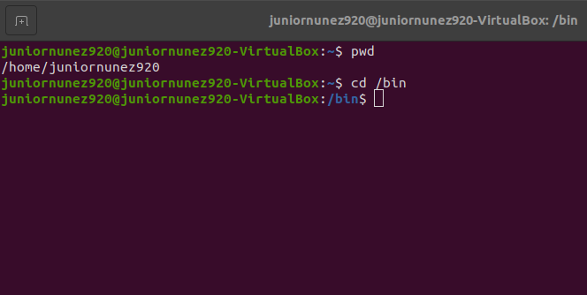
  

2. 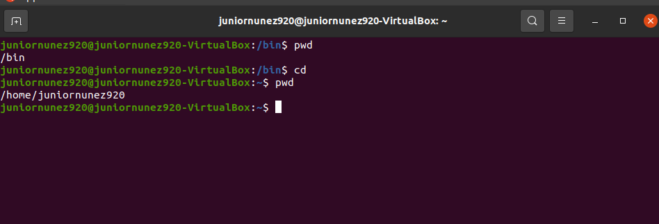
 

3. 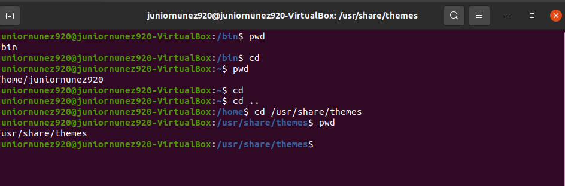
 

4. 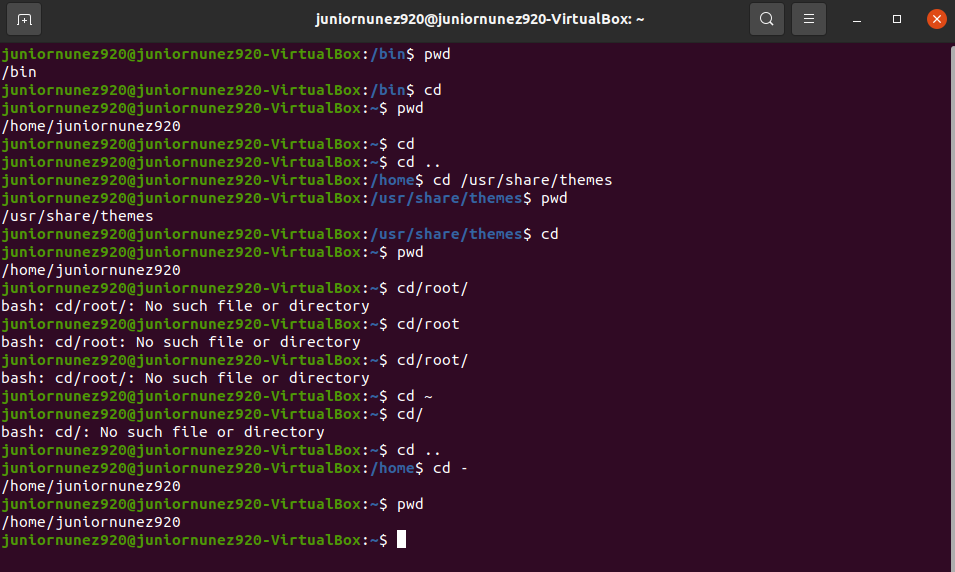
 

5. 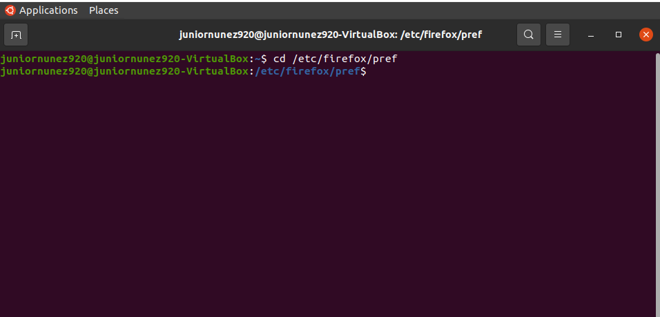
 

##### 6-10 included in the following picture 

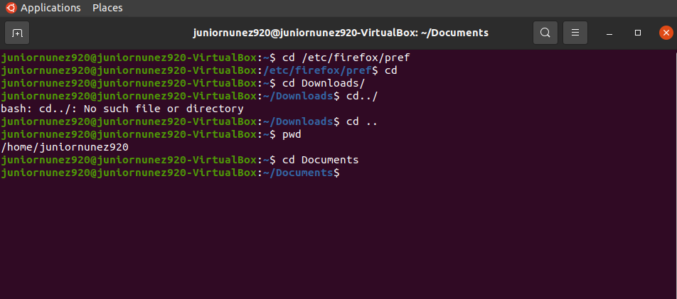

## Question 3
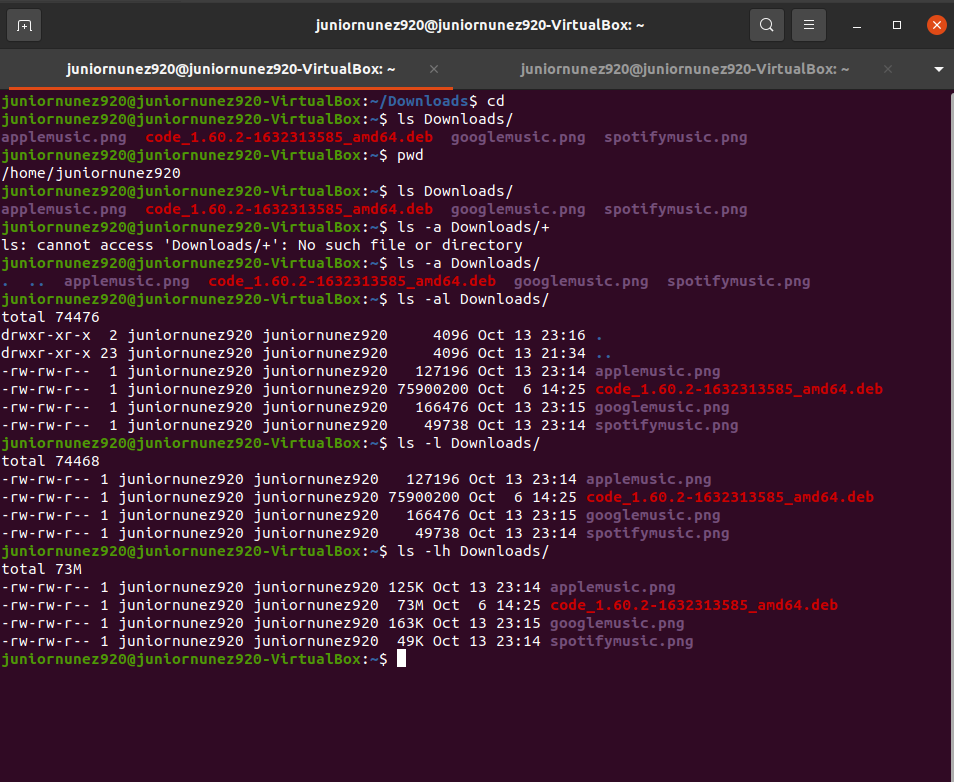

## Question 4
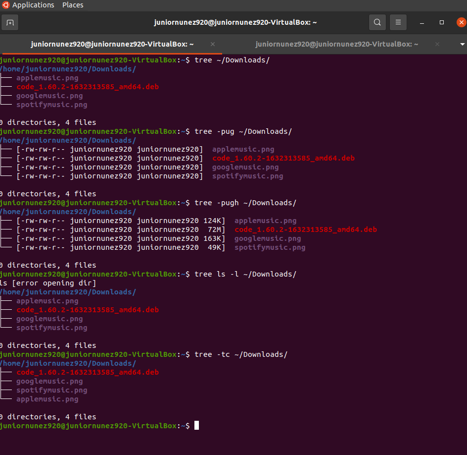

### HTML Part 

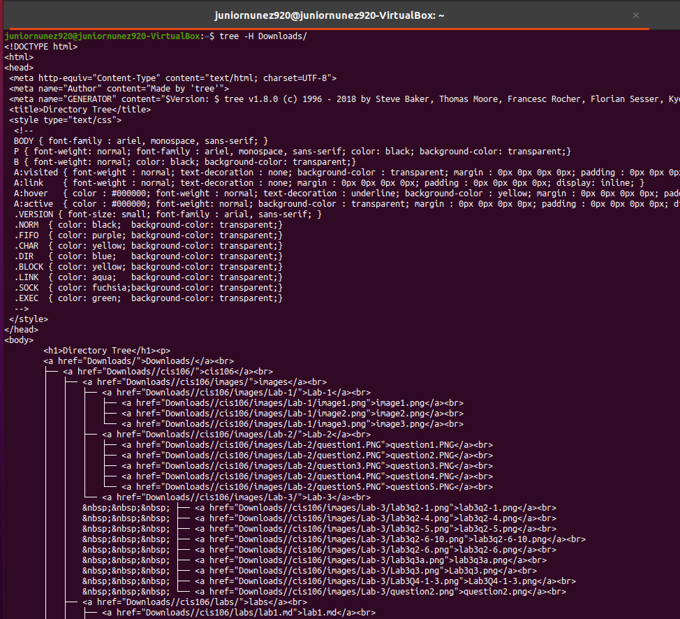
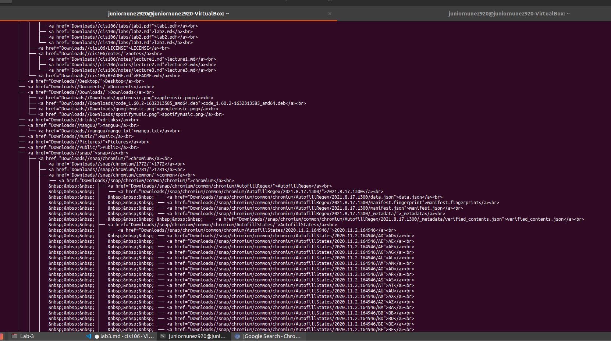
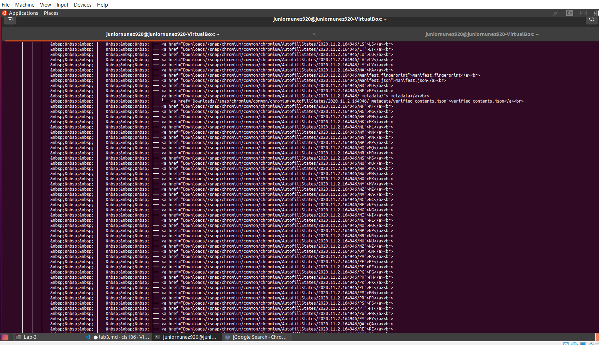
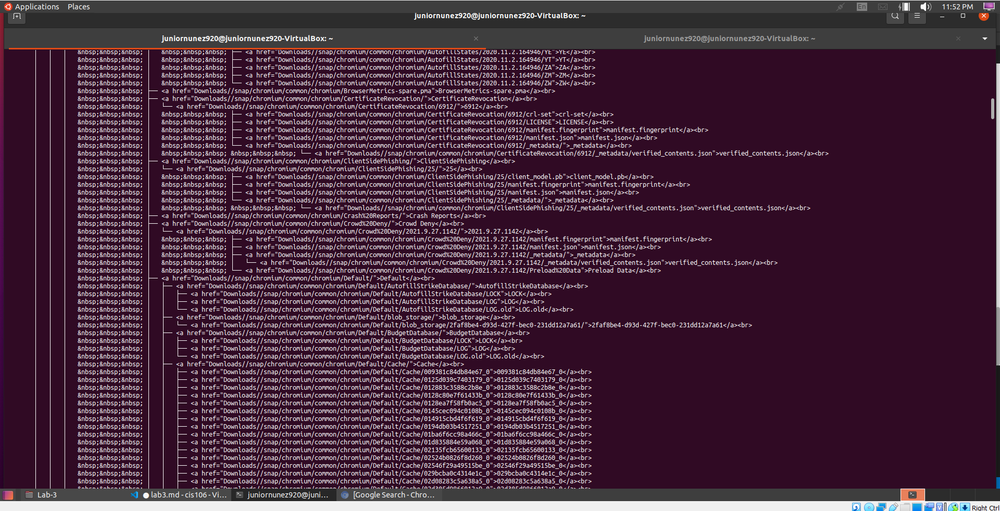
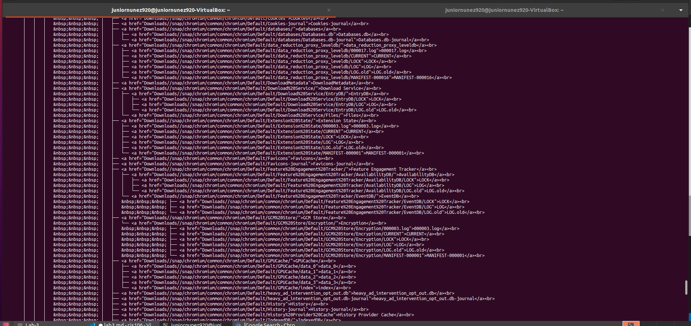
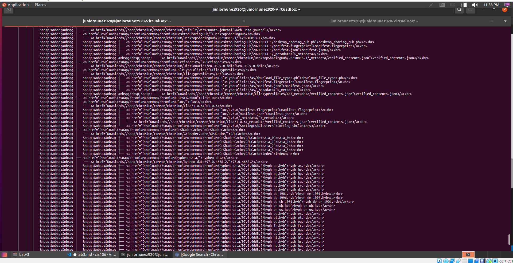
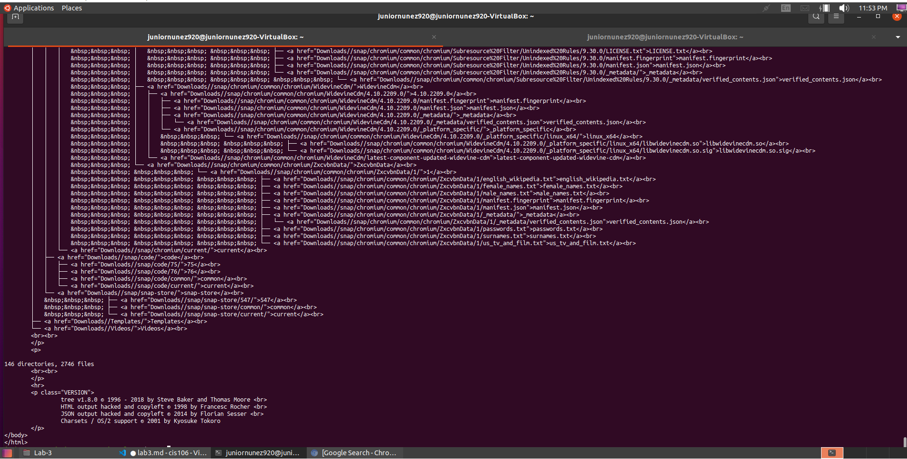

Tree 

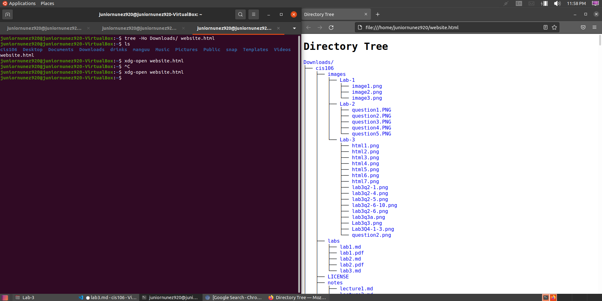

## Question 5

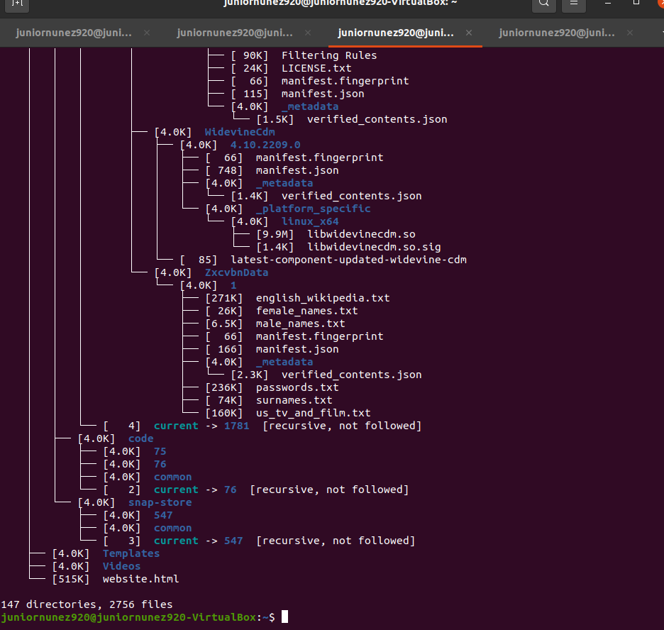
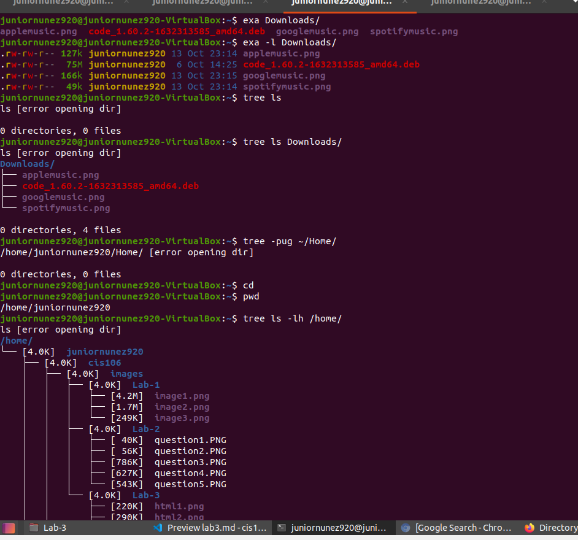

