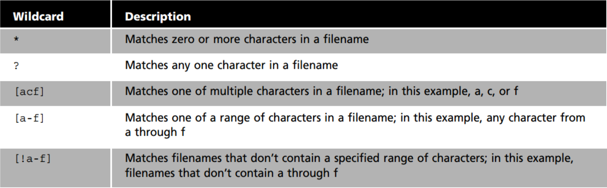

# Lecture 4 
## Hard Links
* Hard Links are files that point to data on the hard drive
* When you create a file by default its linked to the data stored in the hard drive and its assigned an inode number. 

* To create a Hard link: " ln file ~Downloads/fileHL " 

## Soft Links 
* Symbolic links (soft links) are a special type of file that point to other files instead of data in the hard drive
* Soft links do not share the same inode number as a hard link does
* If you modify a soft link the target file is modified as well
* The advantage of soft links is that they can point to files stored on different partitions
* To create a symbolic link: " ln -s file fileSL "

  ## Linux blackhole
 # NEVER RUN
  "sudo rm-r /home/#USER 2>/dev/NULL"

Note to self:

* Never delete hard links

# Getting Help 
WILL PLACE HARD LINKS IN MIDTERM
* man ls 
* man passwd
* man 5 passwd
* man -k passwords

# Using Wildcards / File Globbing 
The main wildcared is a star or asterik (*) character
*Searches for anything that macthes any number or characters. 
For example, ls *.txt will match all files that end in .txt regardless of the size of the file 

b -1
ls -i w/file 

* Expects to use wildcard to move file 
TO FIND .png in the end 
' mv ~/Downloads/*.png /var/www/html/html/Assets/image/ '

To find anything in the middle and everything
' ls B?nana* ' 